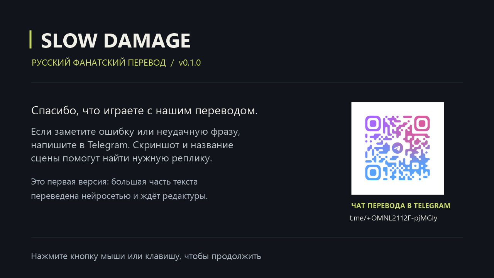
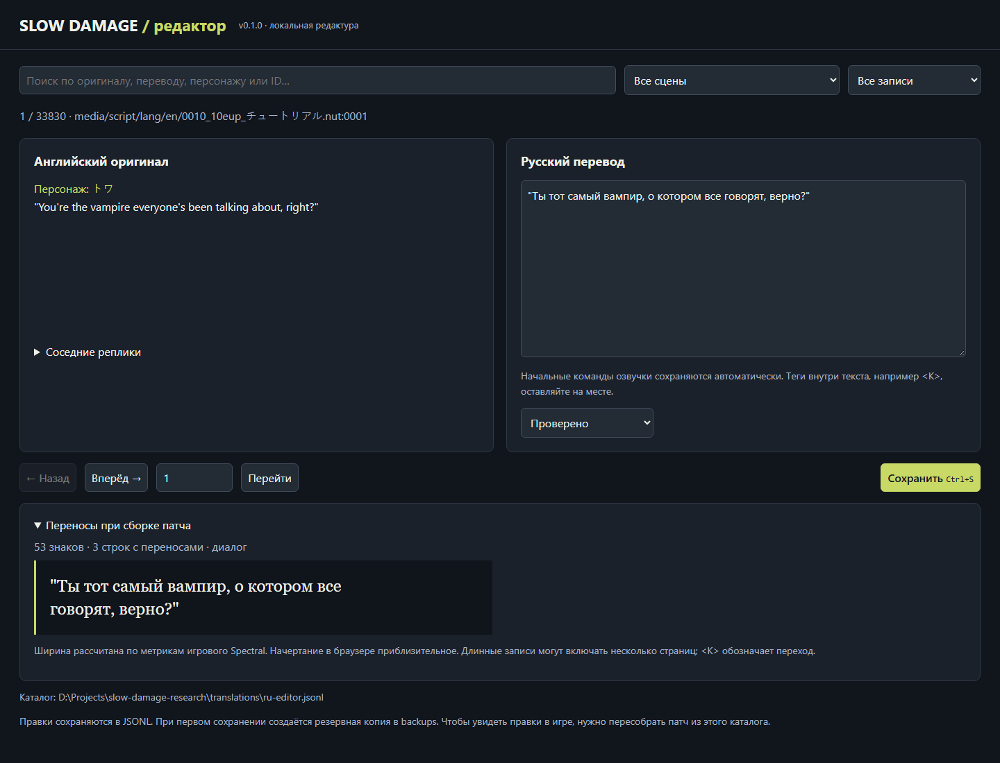

# Slow Damage — русский перевод v0.1.0

[Скачать русификатор](https://github.com/DzhamBeton/slow-damage-russian-patch/releases/download/v0.1.0/SlowDamage-Rus-v0.1.0.zip)
· [Скачать редактор](https://github.com/DzhamBeton/slow-damage-russian-patch/releases/download/v0.1.0/SlowDamage-Translation-Editor-v0.1.0.zip)
· [Страница релиза](https://github.com/DzhamBeton/slow-damage-russian-patch/releases/tag/v0.1.0)




Первый тестовый релиз для английской **JAST USA DRM-free 1.10** с установленным
**Slow Damage Fan Patch**. Русский текст переведён с исправленного английского
сценария Fan Patch. Большая часть перевода машинная; полная литературная
редактура ещё не выполнена.

## Установка

1. Установите игру и английский Fan Patch: `_base2.npk` должен находиться
   в папке игры `patch`. Поддерживается исходный архив с SHA-256
   `e0c983938f4db43df8835d1705e89625834d94973ebe74d6e904b3031a8c209f`.
2. Полностью распакуйте архив русификатора. Закройте игру.
3. Запустите **SlowDamage-Rus-Patcher.exe**, выберите папку
   с `slow_damage_en.exe` и нажмите **Установить**.
4. Запустите игру. После штатного предупреждения появится экран русского
   перевода с QR-кодом и ссылкой на Telegram. Нажмите мышь или клавишу.

Установщик проверяет исходные архивы и контрольные суммы, собирает изменения
во временной папке и создаёт резервные копии. Другие сборки, японская версия
и неизвестные модификации не поддерживаются. Файлы игры целиком в релиз не входят.

Для удаления выберите ту же папку и нажмите **Удалить русификатор**.
Восстановятся файлы, которые были до установки, включая английский Fan Patch
или предыдущую тестовую русскую сборку. Сохранения не удаляются. Резервные копии
остаются в `.slowdamage-rus-backup` в папке игры.

## Что переведено

Сценарий, диалоги, большая часть текстовых выборов и обучения. Исправлены
переносы длинных русских реплик, двустрочные подсказки обучения и отображение
кириллицы. Дополнительно переведены девять строк интерфейса, включая
«Промолчать», и добавлен экран со ссылкой на чат.

Графические надписи меню, например **latest drawing**, и текст внутри части
иллюстраций пока остаются английскими. Прохождение всех маршрутов не проверено:
проведена техническая проверка архивов и начальных игровых сцен.

Русская версия использует отдельную папку сохранений
`%APPDATA%/slowdamage/1.20 Russian Test`. Имя сохранено для совместимости
с предыдущей тестовой сборкой. Английские сохранения остаются в своих папках.
Старые сохранения могут содержать закешированный текст текущей сцены:
новые правки становятся видны после смены сцены или при начале новой игры.

## Редактура и обратная связь

Отдельный архив **SlowDamage-Translation-Editor-v0.1.0.zip** содержит локальный
редактор и текущий каталог. Для редактора нужен Python 3.10+; для установщика
перевода Python не требуется.

Чат перевода: https://t.me/+OMNL2112F-pjMGIy

Сообщая об ошибке, приложите скриншот и название сцены или ID из редактора.
Английская основа и графические исправления принадлежат авторам Fan Patch;
оригинальная игра — Nitro+CHiRAL. Русский машинный перевод, техническая сборка
и редактор подготовлены в этом проекте.

## Исходники

В репозитории находятся исходники установщика и локального редактора.
Каталог перевода и двоичные изменения архивов доступны в ZIP-файлах релиза.
Исходные игровые архивы и исследовательские выгрузки здесь не хранятся.

- `installer/Program.cs` — окно Windows-установщика.
- `installer/install.ps1` — установка, проверка контрольных сумм и восстановление.
- `release/manifest.json` — поддерживаемые архивы и контрольные суммы v0.1.0.
- `editor/` — локальный редактор, Python 3.10+, без сторонних библиотек.
- `scripts/build_installer.ps1` — пересборка установщика на Windows.

Для запуска редактора из исходников скопируйте `translations/translation.jsonl`
из архива редактора в `editor/translations/translation.jsonl`, затем запустите
`editor/START_EDITOR.cmd`. Инструкция: [editor/README.md](editor/README.md).

Для пересборки установщика распакуйте ZIP русификатора в
`dist/SlowDamage-Rus-v0.1.0/` и выполните:

```powershell
powershell -NoProfile -ExecutionPolicy Bypass -File scripts/build_installer.ps1
```

Скрипт использует компилятор .NET Framework из Windows. Папка `payload/`
и манифест берутся из ZIP релиза. Пересборка установщика не меняет перевод:
новая редактура сценария требует отдельной пересборки игровых скриптов и патча.


